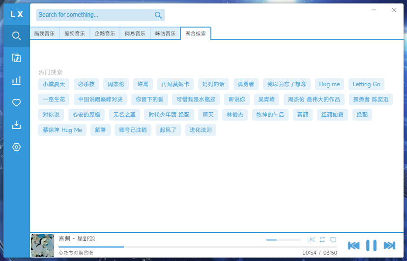

<h1 align="center">LX Music 桌面版</h1>

  
  
  
  
  <!--  -->
  
  <!--  -->

<!-- [![GitHub release][1]][2]
[![Build status][3]][4]
[![GitHub Releases Download][5]][6]
[![dev branch][7]][8]
[![GitHub license][9]][10] -->

<!-- [1]: https://img.shields.io/github/release/lyswhut/lx-music-desktop
[2]: https://github.com/lyswhut/lx-music-desktop/releases
[3]: https://ci.appveyor.com/api/projects/status/flrsqd5ymp8fnte5?svg=true
[4]: https://ci.appveyor.com/project/lyswhut/lx-music-desktop
[5]: https://img.shields.io/github/downloads/lyswhut/lx-music-desktop/latest/total
[5]: https://img.shields.io/github/downloads/lyswhut/lx-music-desktop/total
[6]: https://github.com/lyswhut/lx-music-desktop/releases
[7]: https://img.shields.io/github/package-json/v/lyswhut/lx-music-desktop/dev
[8]: https://github.com/lyswhut/lx-music-desktop/tree/dev
[9]: https://img.shields.io/github/license/lyswhut/lx-music-desktop
[10]: https://github.com/lyswhut/lx-music-desktop/blob/master/LICENSE -->

一个基于 Electron & Vue 开发的音乐软件

## 说明

所用技术栈：

- Electron 30+
- Vue 3

已支持的平台：

- Linux
- macOS
- Windows 7 及以上

*移动版项目地址：https://github.com/lyswhut/lx-music-mobile*

软件变化请查看[更新日志](https://github.com/lyswhut/lx-music-desktop/blob/master/CHANGELOG.md)。

软件下载请查看 [GitHub Releases](https://github.com/lyswhut/lx-music-desktop/releases)。

使用常见问题请参阅[桌面版常见问题](https://lyswhut.github.io/lx-music-doc/desktop/faq)。

目前本项目的原始发布地址只有 [**GitHub**](https://github.com/lyswhut/lx-music-desktop/releases)，其他渠道均为第三方转载发布，与本项目无关！

为了提高使用门槛，本软件内的默认设置、UI 操作不以新手友好为目标，所以使用前建议先根据你的喜好浏览调整一遍软件设置，阅读一遍[音乐播放列表机制](https://lyswhut.github.io/lx-music-doc/desktop/faq/playlist)及[可用的鼠标、键盘快捷操作](https://lyswhut.github.io/lx-music-doc/desktop/faq/hotkey)。

### Scheme URL 支持

从 v1.17.0 起支持 Scheme URL，可以使用此功能在浏览器等场景下调用 LX Music，我们开发了一个[油猴脚本](https://github.com/lyswhut/lx-music-script#readme)配套使用。

脚本安装地址：[LX Music 辅助脚本](https://greasyfork.org/zh-CN/scripts/438148)。

若你想自己调用 LX Music，可以参考文档「[Scheme URL 支持](https://lyswhut.github.io/lx-music-doc/desktop/scheme-url)」部分。

### 数据同步服务

从 v2.2.0 起，我们发布了一个独立的[数据同步服务](https://github.com/lyswhut/lx-music-sync-server#readme)。如果你有服务器，可以将其部署到服务器上作为私人多端同步服务使用，详情看该项目说明。

### 开放 API 支持

从 v2.7.0 起支持开放 API 服务。启用该功能后，将会在本地启动一个 HTTP 服务，提供播放器相关的接口供第三方软件调用，详情看文档「[开放 API 服务](https://lyswhut.github.io/lx-music-doc/desktop/open-api)」部分。

### 数据存储目录

默认情况下，软件的数据存储在：

- Linux：`$XDG_CONFIG_HOME/lx-music-desktop` 或 `~/.config/lx-music-desktop`
- macOS：`~/Library/Application Support/lx-music-desktop`
- Windows：`%APPDATA%/lx-music-desktop`

在 Windows 平台上，若程序文件夹中存在 `portable` 文件夹，则自动使用此文件夹作为数据存储文件夹（适用于 v1.17.0 及以上版本）。

## 用户界面

## 贡献代码

本项目欢迎 PR，但为了 PR 能顺利合并，需要注意以下几点：

- 对于添加新功能的 PR，建议在提交 PR 前先创建 Issue 进行说明，以确认该功能是否确实需要。
- 对于修复 bug 的 PR，请提供修复前后的说明及重现方式。
- 对于其他类型的 PR，则适当附上说明。

贡献代码步骤：

1. 参照[源码使用方法](https://lyswhut.github.io/lx-music-doc/desktop/use-source-code)设置开发环境；
2. 克隆本仓库代码并切换至 `dev` 分支进行开发；
3. 提交 PR 至 `dev` 分支。

## 源码使用方法

请参阅：<https://lyswhut.github.io/lx-music-doc/desktop/use-source-code>

## 项目协议

本项目基于 [Apache License 2.0](https://github.com/lyswhut/lx-music-desktop/blob/master/LICENSE) 许可证发行，以下协议是对于 Apache License 2.0 的补充，如有冲突，以以下协议为准。

---

*词语约定：本协议中的“本项目”指 LX Music（洛雪音乐助手）桌面版项目；“使用者”指签署本协议的使用者；“官方音乐平台”指对本项目内置的包括酷我、酷狗、咪咕等音乐源的官方平台统称；“版权数据”指包括但不限于图像、音频、名字等在内的他人拥有所属版权的数据。*

### 一、数据来源

1.1 本项目的各官方平台在线数据来源原理是从其公开服务器中拉取数据（与未登录状态在官方平台 APP 获取的数据相同），经过对数据简单地筛选与合并后进行展示，因此本项目不对数据的合法性、准确性负责。

1.2 本项目本身没有获取某个音频数据的能力，本项目使用的在线音频数据来源来自软件设置内“自定义源”设置所选择的“源”返回的在线链接。例如播放某首歌，本项目所做的只是将希望播放的歌曲名、艺术家等信息传递给“源”，若“源”返回了一个链接，则本项目将认为这就是该歌曲的音频数据而进行使用，至于这是不是正确的音频数据本项目无法校验其准确性，所以使用本项目的过程中可能会出现希望播放的音频与实际播放的音频不对应或者无法播放的问题。

1.3 本项目的非官方平台数据（例如“我的列表”内列表）来自使用者本地系统或者使用者连接的同步服务，本项目不对这些数据的合法性、准确性负责。

### 二、版权数据

2.1 使用本项目的过程中可能会产生版权数据。对于这些版权数据，本项目不拥有它们的所有权。为了避免侵权，使用者务必在 **24 小时内** 清除使用本项目的过程中所产生的版权数据。

### 三、音乐平台别名

3.1 本项目内的官方音乐平台别名为本项目内对官方音乐平台的一个称呼，不包含恶意。如果官方音乐平台觉得不妥，可联系本项目更改或移除。

### 四、资源使用

4.1 本项目内使用的部分包括但不限于字体、图片等资源来源于互联网。如果出现侵权可联系本项目移除。

### 五、免责声明

5.1 由于使用本项目产生的包括由于本协议或由于使用或无法使用本项目而引起的任何性质的任何直接、间接、特殊、偶然或结果性损害（包括但不限于因商誉损失、停工、计算机故障或故障引起的损害赔偿，或任何及所有其他商业损害或损失）由使用者负责。

### 六、使用限制

6.1 本项目完全免费，且开源发布于 GitHub 面向全世界人用作对技术的学习交流。本项目不对项目内的技术可能存在违反当地法律法规的行为作保证。

6.2 **禁止在违反当地法律法规的情况下使用本项目。** 对于使用者在明知或不知当地法律法规不允许的情况下使用本项目所造成的任何违法违规行为由使用者承担，本项目不承担由此造成的任何直接、间接、特殊、偶然或结果性责任。

### 七、版权保护

7.1 音乐平台不易，请尊重版权，支持正版。

### 八、非商业性质

8.1 本项目仅用于对技术可行性的探索及研究，不接受任何商业（包括但不限于广告等）合作及捐赠。

### 九、接受协议

9.1 若你使用了本项目，即代表你接受本协议。

---

若对此有疑问请 mail to: lyswhut+qq.com (请将 `+` 替换为 `@`)
